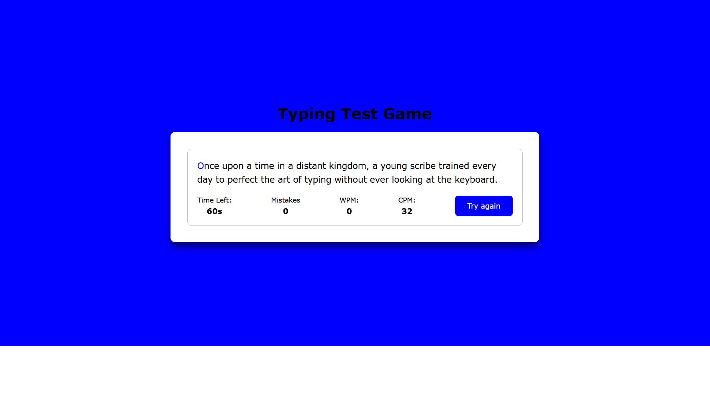
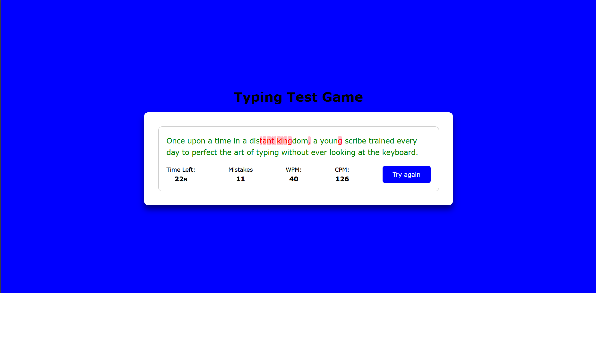

# ⌨️ Typing Test Game

A fun and responsive web-based **Typing Test Game** that challenges your typing speed and accuracy in real time. Test how fast you can type in 60 seconds and get real-time feedback on your **WPM (Words Per Minute)**, **CPM (Characters Per Minute)**, and **Mistakes**.

---

## 🚀 Features

- ✅ Randomly generated sentences for every session
- ✅ Real-time WPM, CPM, and mistake tracking
- ✅ Visual feedback on correct and incorrect keystrokes
- ✅ Responsive and modern user interface
- ✅ Instant restart button to try again

---

## 🛠️ Tech Stack

- **HTML5**
- **CSS3**
- **JavaScript (Vanilla)**

---

## 📁 File Structure

```bash
typing-speed-test/
│
├── index.html         # Main HTML file
├── style.css          # CSS styles
├── script.js          # JavaScript logic
├── screenshot.png     # Screenshot of the project (optional)
└── README.md          # This file

## Screenshots



## 📦 Installation

To run the project locally:

```bash
git clone https://github.com/yourusername/typing-speed-test.git
cd typing-speed-test
